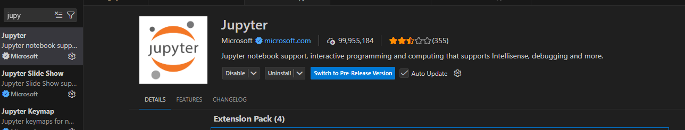

# 260112

## python

    
    vscode extension Jupyter 설치

    Docs/python/README.md 참고


## 파이썬 설치

    - [공식](https://www.python.org/downloads/)
    - [Anaconda](https://www.anaconda.com/)

    vscode extenstion python 설치

## 기본 실행
    터미널에 python (파일명.py)
    python만 치면 터미널에 실행
    종료는 exit()

## pip 

    |명령어|설명|예시|
    | :--- | :--- | :--- |
    | pip install 패키지명 | 특정 패키지를 설치합니다. | pip install requests
    | pip uninstall 패키지명 | 설치된 패키지를 삭제합니다. | pip uninstall requests
    | pip list | 현재 설치된 모든 패키지 목록을 보여줍니다. | pip list
    | pip show 패키지명 |특정 패키지의 상세 정보를 확인합니다. |pip show pandas
    | pip install --upgrade 패키지명 | 패키지를 최신 버전으로 업데이트합니다.| pip install --upgrade numpy

## 파이썬 독립적인 프로젝트 관리
```bash
python -m venv (폴더명)
```
- 프로젝트 폴더 구조 (Windows 기준)
```
project/
 ├─ venv/
 │   ├─ Scripts/
 │   ├─ Lib/
 │   └─ pyvenv.cfg
 ├─ main.py
```

- venv 활성화(Activate)
```bash
venv\Scripts\activate
```

- venv 비활성화(Deactivate)
```bash
deactivate
```

## Jupyter Notebook 알아보기

> 1. Jupyter 설치
```bash
pip install jupyter
```

> 2. Jupyter 실행하기
```bash
jupyter notebook &
```
- 종료 하려면 터미널창을 끄거나 PID 검색하여 `kill -9` 사용하여 강제 종료 할 수 있습니다.

> 3. Jupyter 웹페이지 접속하기 (자동접속)
```bash
http://localhost:8888
```

## Google Colab
    google colab 검색 -> Open Colab
