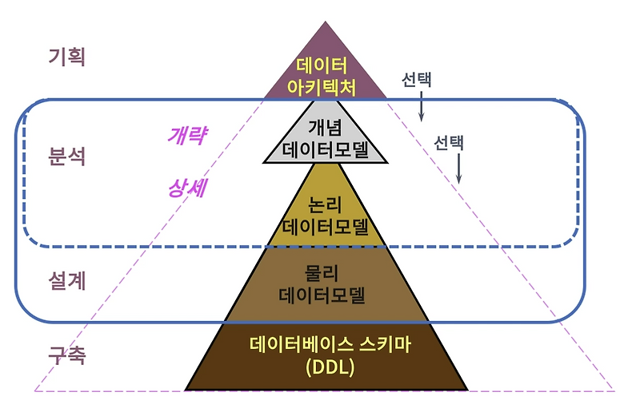
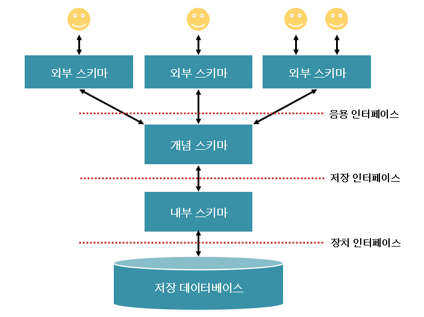

# 260117

## - 데이터베이스의 개념
    - 데이터를 일정한 순서와 체계로 통합하고 중복을 배제하여 컴퓨팅 시스템에 저장하여 여러 사용자가 공유하는 데이터의 집합

  ### 기획 - 데이터 아키텍처
    전체적인 설계도 : 표준/흐름 등 정의

  ### 개념적 설계 
    - 엔티티(Entity) : 데이터를 저장하고자 하는 대상 (ex. 영화)
    - 속성(Attribute) : 엔티티에 저장하려는 내용 (ex. 제목, 감독, 개봉일, .. 등등)
    - ERD : 개체-관계 모델
    핵심 엔티티 사이의 관계 설정 단계로 주로 ERD 사용

  ### 논리 모델 / 물리 모델
| 논리 모델 | 물리 모델 | 
| :--- | :--- |
| 이상적, 정확도 | 현실적, 성능 |
| 데이터 중복 저장x, 3차 정규형을 만족 | 현실적인 요소 감안 |
| 본격적인 스키마 설계 | 테이블 생성 / 알고리즘 최적화 |

  ### DDL( Data Definition Language, 데이터 정의어 )
    - 데이터베이스의 전체 골격 구성 역할
| 명령어 | 기능 | 설명 |
| :--- | :--- | :--- |
| **CREATE** | 생성 | 새로운 데이터베이스 객체(테이블, 뷰, 인덱스 등)를 만듭니다. |
| **ALTER** | 수정 | 기존에 생성된 객체의 구조를 변경합니다. (컬럼 추가, 타입 변경 등) |
| **DROP** | 삭제 | 객체를 완전히 삭제합니다. (구조와 데이터 모두 삭제) |
| **TRUNCATE** | 초기화 | 테이블의 구조는 남겨두고 데이터(내용물)만 전부 삭제합니다. |

## - 데이터베이스 스키마

| 구분 | 관점 | 내용 | 특징 |
| :--- | :--- | :--- | :--- |
| **외부 스키마**(External Schema) | 사용자나 응용 프로그램 개발자 관점 | 전체 데이터베이스 중 특정 사용자가 필요로 하는 부분적인 논리 구조 | 여러 개 존재 가능, '서브 스키마'나 '뷰(View)'라고도 불림 |
| **개념 스키마**(Conceptual Schema) | 기관 전체나 통합적 관점 | 데이터베이스의 전체적인 논리 구조 (모든 엔티티, 관계, 제약 조건 정의) | 단 하나만 존재, 일반적인 '스키마'의 의미 (DBA가 관리) |
| **내부 스키마**(Internal Schema) | 물리적 저장 장치 관점 | 실제로 데이터가 하드디스크에 저장되는 방식 정의 | 데이터 실제 저장 구조, 인덱스 유무, 필드 크기 포함 |